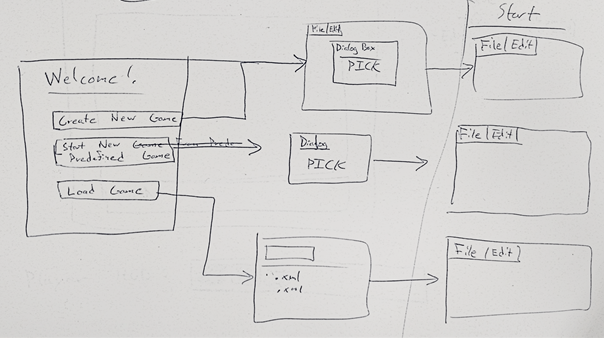

Design Document

#Introduction

*This section describes the problem your team is trying to solve by writing this program, the primary design goals of the project (i.e., where is it most flexible), and the primary architecture of the design (i.e., what is closed and what is open). Describe your chosen game genre and what qualities make it unique that your design will need to support. Discuss the design at a high-level (i.e., without referencing specific classes, data structures, or code).*

Our team is trying to create an interface for a user to create and play Tower Defense games. The user will be able to load or create a game from a blank template, which the user can later play.

Tower Defense:
* Tower Defense games are strategy games where the goal is to defend the user’s health, structures, etc. by defending against the enemy attackers. Often, this is done by placing towers, obstructions, or damaging objects along the enemy’s path of attack. The game is played in real-time, and the user can interact with the game at any time, by for instance adding new towers if possible.
* These qualities are what differentiate Tower Defense games from other games. Specifically our design will need to support real-time interaction between the user and the various structures on screen as the game progresses, determine how the various objects on screen interact (like a tower’s projectile and an enemy, or an enemy reaching the end of the path), and ultimately allow the user to define these various interactions and rules in the authoring environment. 

Design goals:
* With this in mind, our design needs to be most flexible regarding the various objects (structures, enemies, etc.) that can be created and how they interact with each other. For instance, it should be easy to add another enemy or tower to the Grid and to define the rules for their interaction with everything else on screen and the user. In addition, the types of interaction that can happen should be flexible. For instance, changing or defining a new event that should happen when two objects collide should be very doable without having to change various details of the classes involved. 

Primary Architecture: 
* What is open: In our program, what needs to be open are the abstract elements of our game--like enemies, towers, tiles (like water, grass, empty)--and how they can interact with each other. One should be able to extend these elements to easily include another one, like adding a new type of tower that shoots cannonballs for instance or even adding an entirely new “player” in the game, that has differently characteristics. There are other elements of our game that will be open for extension, such as the path that the enemies take. This is more of something that will be done towards the end of the project if we decide to perform this extension, but as an example, one should be able to add a new type of path-finding algorithm to accommodate for a different version of the game where enemies move along a different path or move randomly. 
* What is closed, then, is how these specific instances of these elements (like a specific type of tower, enemy, or tile) interact with each step of the game. For instance, one should be able to add a new type of enemy, like one really slow one that has a lot of health, but the existence of specific characteristics (like health, speed, etc.) should be closed to modification. 

Design at a high level:
* At a high level, our program can be divided into the four components: game authoring environment, game engine, game player, and game data. Once the game is launched, the authoring environment allows the user to either load a previous version of a game or make one from a blank template. Within this authoring environment, the user will be to able to determine the rules and layout of the game, loosely speaking (more on this later on). The options for setting up the game come from the game engine and are displayed to the user to implement. Once the game has been set up, the game player displays all relevant information on screen (like the HUD) and dynamically updates the UI. The user can interact with what’s on screen depending on the exact features of the game, but will include things like dropping new towers if possible, obstructing enemies, etc. The player dynamically updates what’s on screen, while the game engine steps through the game loop, advancing the various elements on screen and holds rules for their interaction. The game data will be used for saving and loading games and game states, but there will also be various media files, like images and potentially sound. 

#Overview

*This section serves as a map of your design for other programmers to gain a general understanding of how and why the program was divided up, and how the individual parts work together to provide the desired functionality. Describe specific modules you intend to create, their purpose with regards to the program's functionality, and how they collaborate with each other, focusing specifically on each one's API. Include a picture of how the modules are related (these pictures can be hand drawn and scanned in, created with a standard drawing program, or screen shots from a UML design program). Discuss specific classes, methods, and data structures, but not individual lines of code.*

| Module  | Purpose  | How they collaborate  |
|---|---|---|
| Controller  | Holds single instance of: (State, Rules, Data, Environment, Engine, Skeleton)   |  Pass state to Engine and Environment so that they can edit as needed. Have rules set (and possibly changed) by Environment. Give unmodifiable rules to Engine . When Data is needed (save/load), Controller will call methods to pass relevant data from everything to Data |
| Environment  | Contains (Mode, Structure Bank) |   |
| Engine  |  Game Loop. Goes through structures and updates their properties via the state |   |
| Skeleton  | The common visual components and methods from all games (Menu Bar, View, HUD)  |  Can switch the mode (in Environment). Grabs status from State to display HUD. Triggers new/save/load. Play and pause buttons that start and stop update loop in engine |

#User Interface

*This section describes how the user will interact with your program (keep it simple to start). Describe the overall appearance of program's user interface components and how users interact with these components (especially those specific to your program, i.e., means of input other than menus or toolbars). Include one or more pictures of the user interface (these pictures can be hand drawn and scanned in, created with a standard drawing program, or screen shots from a dummy program that serves as a exemplar). Describe how a game is represented to the designer and what support is provided to make it easy to create a game. Finally, describe any erroneous situations that are reported to the user (i.e., bad input data, empty data, etc.).*

On program launch, the user will be prompted to either create an entirely new game, start a new game from a predefined list, or load a previous game from an XML file. 
1. "Create New Game"
    * Open View with dialog box to select options
    * Once all required options are chosen, show View/Skeleton
2. "Start New Predefined Game"
    * Dialog box that somehow displays choices
    * On selection, show View/Skeleton
3. "Load Game"
    * Open FileChooser in SavedGames folder
    * On selection, show View/Skeleton

The View is the visual Stage/Scene displaying the Environment and the Skeleton.  The Environment contains the state of the game. The Skeleton has the visual components that are common to all games. This will include a bottom bar and side bar. In the these bars will be a settings button that will have the following options: New, Load, Save, Rules, Change Mode. There will also be a TextArea that presents what Mode the use is in (God Mode, Player Mode: Playing, Player Mode: Paused). There will also be buttons that Play, Pause and FastForward the game. Somewhere on these bars there will be a place for the status values of the game (Health, Lives, Score, XP, etc.)

#Design Details 

*This section describes each module introduced in the Overview in detail (as well as any other sub-modules that may be needed but are not significant to include in a high-level description of the program). Describe how each module handles specific features given in the assignment specification, what resources it might use, how it collaborates with other modules, and how each could be extended to include additional requirements (from the assignment specification or discussed by your team). Note, each sub-team should have its own API for others in the overall team or for new team members to write extensions. Finally, justify the decision to create each module with respect to the design's key goals, principles, and abstractions.*

##Key of Interfaces
- “Tiles” maintain information about the location including rules for objects moving there (i.e. indicating whether something can/cannot move over that land, whether something can/cannot be built on that land, etc.)
- “Structures” include any object that interacts with another object (balloons, towers, projectiles, etc.). “Structures” keep track of their own “Move Behavior”, “Death Behavior”, “Interaction Behavior”, “Health Behavior”, “Damage Behavior”, “Breed Behavior”, “Spawn Behavior”. It will also hold it’s own size (number of tiles it takes up)
- “Move Behavior” are classes that dictate how a “Structure” should move, whether it be ‘follow the path’ or ‘move from this point to this point using an algorithm’. There will be a default list of rules to choose from and an ability to code more.
- “Death Behavior” are classes that dictate what happens when a “Structure’s”  Health reaches zero. There will be a default list of behaviors to choose from and an ability to code more.
- “Interaction Behavior” are classes that dictate how “Structures” respond to particular user input (i.e. click, drag, etc.). Each “Structure” will have an empty method (behavior) for all of the possible user inputs and the user will be able to choose what the method/behavior corresponds to each given user input. There will be a default list of behaviors to choose from and an ability to code more.
- “Damage Behavior” are classes that dictate how “Structures” inflict harm, and how much harm
- “Breed Behavior” are classes that dictate how “Structures” spawn new “Structures” (e.g. could make a new version of itself or a projectile), but isn’t connected to the new structure when it’s done. 
- “Collision Rules” are the classes that dictate what occurs when a “Collision Event” occurs between two particular “Structures”. There will be a default list of rules to choose from and an ability to code more. Unlike the other “Behavior” characteristics of “Structures”, “Collision Rules” are stored in the Game Engine for they will likely have to deal with more than one “Structure” and therefore it will be easier to have this stored in a central location and not have each type of “Structure” have code of how they will respond to collisions with every type of “Structure”.
- “Spawn Rules”
- “Win/Loss Rules”
- “Goal Rules”

Environment
- Grid -> the state of the map that will be SAVABLE for when “Skeleton” indicates a save should occur. Consisting of multiple 2-D arrays of...
	* “Tiles” that exist at that location 
	* “Structures” that are currently at each location. 
- Game element bank -> Bank of “Structures” that the user can choose from to place in the map
- View
- Stage Progression -> Perhaps a Queue to indicate what the next games to load should be.
- Mode - Superclass -> Abstract Class that will contain all features that are similar between the God Mode and the Player Mode
	* Place towers
	* Set animation speed
	* Types:
		* God
			* Create any tower
			* Change/Create rules
				* Of “Structures”
				* Global collision rules
				* W/L conditions
				* Stage progression
			* Player
				* Accrue score
				* collect in-game collectables
				* Run animation
				* Play / Win / Lose
				
Engine
* Rule categories ->  questions to ask the user
	* What are goals of the game?
	* What is a winning condition?
	* What is a losing condition?
	* What happens on collisions?
* Rules -> possible answers to those questions, there are default Rules and an ability to code in more
* Current rules -> the rules selected and used during gameplay
	* This will be saved to XML when user hits “save”
* Game status info -> status of current user throughout the game
	* Points, time, score
* Game loop -> Animation (step) that occurs and tells component engines that the time has passed
* Component Engines -> minor engines with information (frame rate) about when the given engine should update its components
	* Movement
* Error checking -> Situations that cannot happen for the engine to check for
	* If two things are on the same spot
	* Incompatible rules

Skeleton
* HUD
	* Gets status from Engine
* Settings
	* Play
	* Pause
	* Switch game (New, load, save)
* Mode Choice
		
		
Data
* Loads and Saves both Rules and States	
	

#Example games

*Describe three example games from your genre in detail that differ significantly. Clearly identify how the functional differences in these games is supported by your design and enabled by your authoring environment. Use these examples to help make concrete the abstractions in your design.*

|   | Plants vs. Zombies  | Bloons Tower Defense  | Desktop Tower Defense  |
|---|---|---|---|
|  Winning - level | kill all enemies | No more enemies on Grid  |   |
|  Winning - game | play until loss | play until loss  |   |
|  Losing | Enemy reaches base  | User health to Zero  |   |
|  Path Movement | fixed, multiple, objects can jump paths  | fixed, can be multiple, objects fixed to path  | variable  |
| Score  | XP  | No  | ??  |
| Money - Use  | buy: towers, collectabes, abilities  | buy: towers, colletables, abilities, upgrades  | tower upgrades  |
| Money - Retrieval  |  automatic, sun clicking | kill bounty, level bonus  | kill bounty  |
| Towers - Creation  | Buy| Buy |  ?? |
| Towers - Deletion  | Killed or removed  |  sold | ??  |
| Enemies  | Waves in level  | Waves in level  | Waves in level  |

#Design Considerations 

*This section describes any issues which need to be addressed or resolved before attempting to devise a complete design solution. Include any design decisions that each sub-team discussed at length (include pros and cons from all sides of the discussion) as well as any ambiguities, assumptions, or dependencies regarding the program that impact the overall design.*

Issues: There is still some uncertainty present in the exact structure for storing the data, such as how to divide it up and what needs to be written to XML.

Design Discussions:
One discussion was where to store the data for each game. Originally, we made no distinction between game state data and rule data but this design was not ideal because state and rules may need to be saved and loaded separately. Instead we decided to go with a separation of rule and state data to address this issue.

The purpose of the game engine was discussed at length. We considered an option where the game engine handles everything, including movement of game elements. However, this option was not ideal since it meant the game engine had to keep track of the movement rules for each game element. It would be more natural and better encapsulated if the movement rules for each game element are stored in that type of game element and all the engine has to do is call element.move() to execute the correct movement of an element. Because of this, we decided on an engine that continuously calls update (more general version of move()) on the elements of a game and only steps in when a game element does not know how to proceed, such as when a collision occurs between two elements. When the game engine steps in, it checks to collision with its game-wide collision rules and updates the state accordingly.

Another discussion was the relationship between the game authoring environment and the game player. Originally, we planned on having the game player being housed within the game authoring environment, but after reading the design specification more closely, we decided to separate these components into a hierarchy. Instead, there is now a more generic Environment object of which the game authoring environment and player environment are subclasses but are their own distinct implementations of the generic Environment. This provides separation of player and authoring environment. 

Assumptions/Dependencies:
The assumptions and dependencies are discussed in the previous sections.

